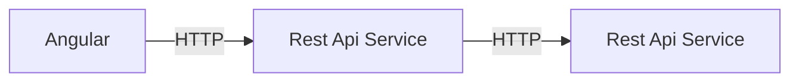

# Microservices application with Java, Rest And Spring Boot
The purpose of this project is to demonstrate the use of **Go** language to create a simple Microservices application.
# Flow

# Run
You can run this application in three way:
- In starting the three apps individually.
- Using Docker-compose included.
- Minikube with de yaml deployment files in k8s
## Individual start
### Steps
- In the folder server : go run main.do
- In the folder client : go run main.do
- In the folder angular : ng serve --open
### Test
After open the browser to: http://localhost:4200/sayhello
## Docker-compose
### Steps
-Use docker-machine ip to find your ip ex:  192.168.99.100
-Change the docker-compose.yml to correctly setting environment.ts file
-See the environment.ts file sample in docker compose
-In the folder docker-compose : docker-compose ip -d
### Test
After open the browser to: http://192.168.99.100:4200/sayhello
## Minikube
### Steps
- In the folder k8s run: kubectl apply -f *.yaml
- Forward the port: kubectl port-foward my-angular-pod 4200:4200
### Test
After open the browser to: http://localhost:4200/sayhello
# ToDo
- Setup a Nginx Ingress
